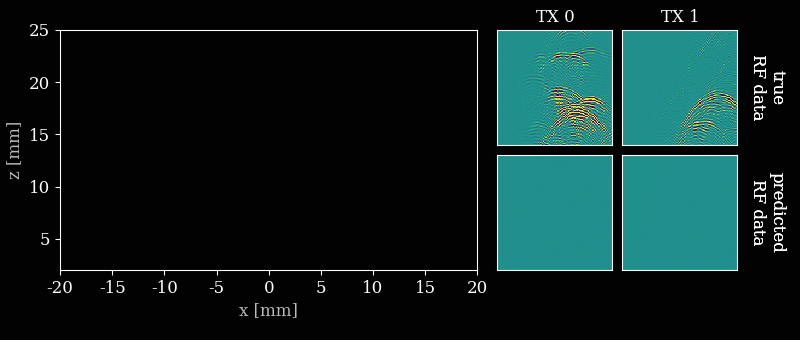

# Off-Grid Ultrasound Imaging by Stochastic Optimization
This is the code repository accompanying the paper [Off-Grid Ultrasound Imaging by Stochastic Optimization](https://arxiv.org/abs/2407.02285).
INverse grid-Free Estimation of Reflectivities (INFER) is a method for off-grid ultrasound imaging. Instead of beamforming RF data, we construct a matrix-free forward model of the acquisition process and optimize for the reflectivities, backscatter source locations, and other tissue and transducer parameters directly.

The data acompanying the paper can be found in the [Zenodo repository](https://zenodo.org/records/14925758).

Please refer to these instructions for running the code on your system:
- [How to run the code on Windows](running_on_windows.md)
- [How to run the code on Linux or macOS](running_on_linux_macos.md)